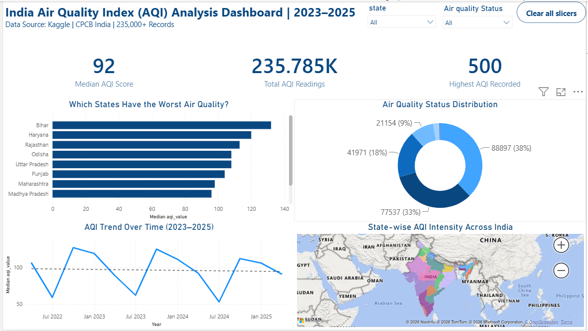

# 🇮🇳 India Air Quality Index (AQI) Dashboard | 2023–2025

## 📌 Project Overview
An interactive Power BI dashboard analyzing **235,785 air quality records** across Indian states and cities from 2023 to 2025. Built to uncover pollution trends, identify the most affected regions, and understand seasonal AQI patterns across India.

---

## 📊 Dashboard Preview

---

## 🎯 Key Insights
- 🏆 **Bihar** is the most polluted state (Median AQI: 135)
- 📈 **Winter months** show AQI spikes due to cold air trapping pollutants
- 🌧️ **Monsoon months** show AQI drops as rain cleans the air
- ⚠️ **Max AQI recorded: 500** (Severe/Hazardous level)
- 📊 **38% of readings** fall in "Satisfactory" category
- 🗺️ **North India** consistently more polluted than South India

---

## 🛠️ Power BI Skills Utilized
- ⚙️ Power Query — Data Cleaning & Transformation
- 📅 Date type conversion & data type fixes
- 🔢 KPI Cards with custom titles & subtitles
- 📊 Bar Chart with Top N filtering
- 🍩 Donut Chart for categorical distribution
- 📈 Line Chart for time-series trend analysis
- 🗺️ Filled Map for geospatial visualization
- 🎛️ Slicers for interactive cross-filtering
- 🔄 Cross-filtering between all visuals

---

## 📁 Data Source
- **Source:** Kaggle — [India AQI Dataset 2023–2025](https://www.kaggle.com/datasets/saikiranudayana/india-air-quality-index-aqi-dataset-20232025)
- **Original Data:** CPCB (Central Pollution Control Board), India
- **Records:** 235,785
- **Time Span:** 2023 – April 2025
- **Columns:** date, state, area, number_of_monitoring_stations, prominent_pollutants, aqi_value, air_quality_status

---

## 📐 Dashboard Visuals
| Visual | Description |
|---|---|
| KPI Cards | Median AQI, Total Readings, Highest AQI |
| Bar Chart | Top 10 Most Polluted States by Median AQI |
| Donut Chart | Air Quality Status Distribution |
| Line Chart | AQI Trend Over Time (2023–2025) |
| Map Visual | State-wise AQI Intensity Across India |
| Slicers | Filter by State & Air Quality Status |
